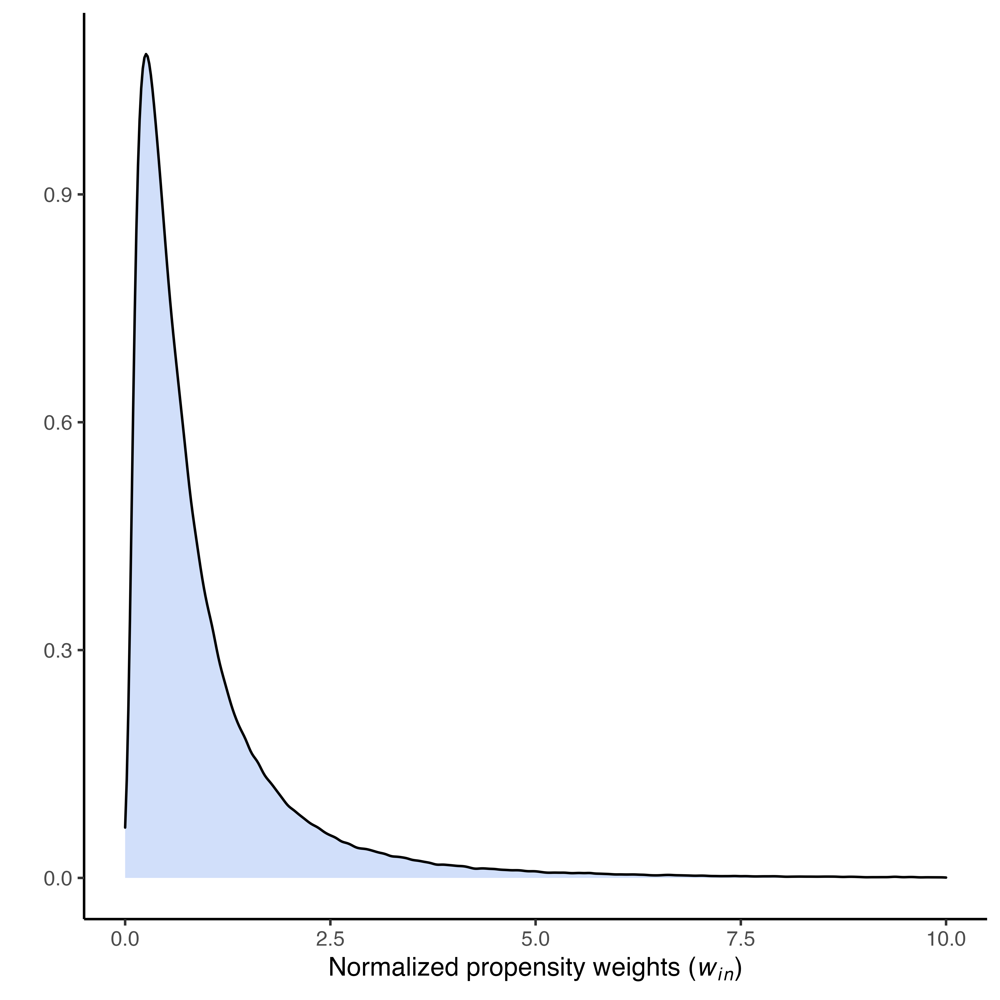
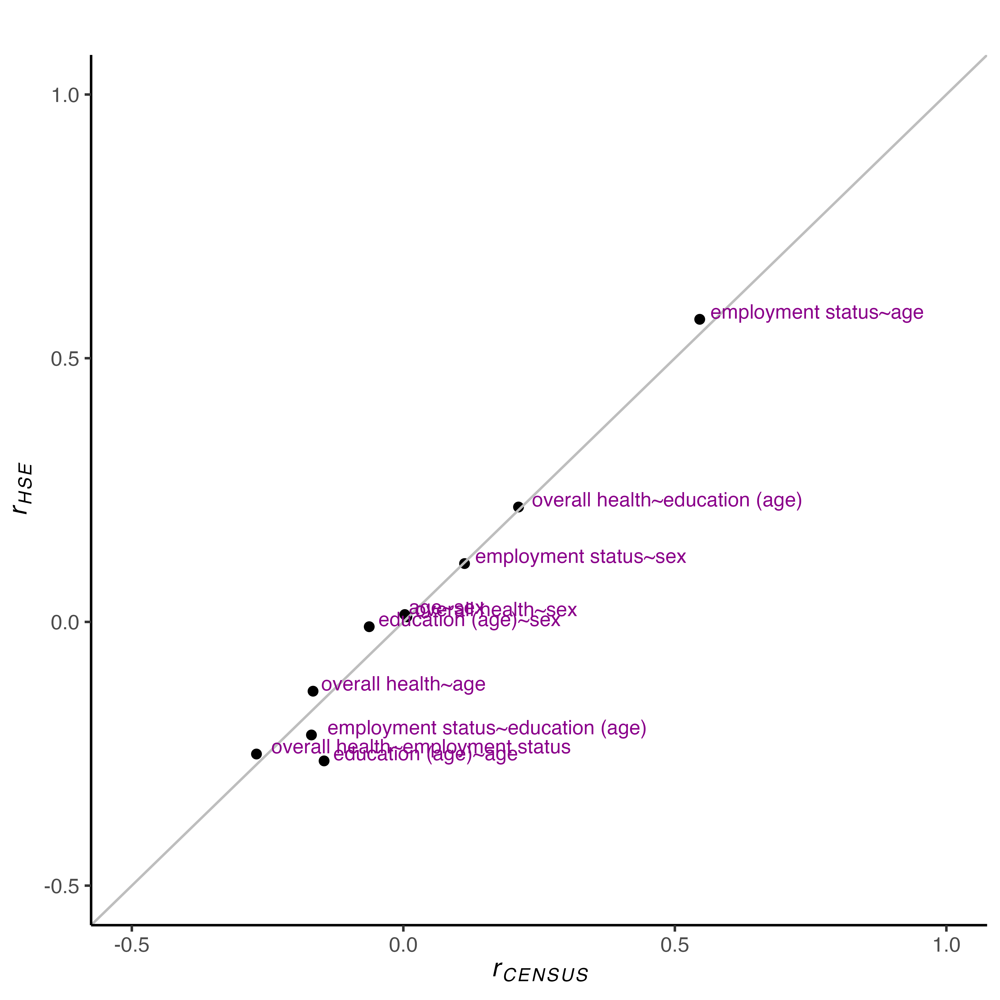
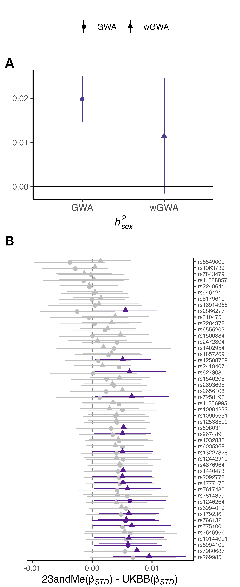

Correction for participation bias in the UK Biobank
================

# Overview

The complete analytical pipeline used to run the weighted genome-wide
association analyses is included in the script
[UKBBweightingPipeline.sh](https://github.com/TabeaSchoeler/TS2021_UKBBweighting/blob/main/analysis/UKBBweightingPipeline.sh).

 

The scripts used to process the results and prepare the plots and table
for publication are included in the R script
[UKBBweighting.R](https://github.com/TabeaSchoeler/TS2021_UKBBweighting/blob/main/analysis/UKBBweighting.R).

 

-   [Generation of the UKBB Sampling
    Weights](#generation-of-the-ukbb-sampling-weights)

    -   [Preparation of UKBB phenotype
        data](#preparation-of-ukbb-phenotype-data)
    -   [Preparation of HSE phenotype
        data](#processing-of-hse-phenotype-data)
    -   [Assess performance of the sampling
        weights](#assess-performance-of-the-sampling-weights)
    -   [Compare with UK Census data](#compare-with-uk-census-data)
    -   [Prepare genotype data](#prepare-genotype-data)

-   [Weighted genome-wide association
    analyses](#weighted-genome-wide-association-analyses)

    -   [Prepare genotype data for
        LDAK](#prepare-genotype-data-for-ldak)
    -   [Perform weighted GWA in LDAK](#perform-weighted-gwa-in-ldak)
    -   [Process LDAK output](#process-ldak-output)
    -   [Get SNP correlations](#get-snp-correlations)

-   [Downstream GWA analyses](#downstream-gwa-analyses)

    -   [LD Score regression and heritability
        estimates](#ls-score-regression-and-heritability-estimates)
    -   [Autosomal GWA on sex](#autosomal-gwa-on-sex)
    -   [Mendelian Randomization
        analyses](#mendelian-randomization-analyses)

-   [Summary of findings](#summary-of-findings)

    -   [Main Figures](#main-figures)
    -   [Supplementary Figure](#supplementary-figures)
    -   [Supplementary Tables](#supplementary-tables)

  

# Generation of the UKBB Sampling Weights

 

#### Preparation of UKBB phenotype data

    # ======= Merge UKBB phenotype data ==============
    sbatch --export=HOME=$HOME,sample="extractUKBB" --chdir=$HOME/output/log --job-name recodePheno.${sample} --partition=cluster2 $HOME/analysis/recodePheno.sh

Executes the script
[exxtractUKBB.R](https://github.com/TabeaSchoeler/TS2021_UKBBweighting/blob/main/analysis/exxtractUKBB.R)

 

    # ======= Prepare UKBB phenotype data ==============
    sbatch --export=HOME=$HOME,sample="UKBB" --chdir=$HOME/output/log --job-name recodePheno.${sample} --partition=cluster2 $HOME/analysis/recodePheno.sh

Executes the script
[recodePhenoUKBB.R](https://github.com/TabeaSchoeler/TS2021_UKBBweighting/blob/main/analysis/recodePhenoUKBB.R)

 

#### Preparation of HSE phenotype data

    # ======= Prepare HSE phenotype data ==============
    $HOME/programs/R-4.1.2/bin/R --no-save < $HOME/analysis/recodePhenoHSE.R --args $HOME > $HOME/output/log/recodePhenoHSE.log 2>&1 & disown

Executes the script
[recodePhenoHSE.R](https://github.com/TabeaSchoeler/TS2021_UKBBweighting/blob/main/analysis/recodePhenoHSE.R)

 

    # ======= Prepare HSE/UKBB data for weighting ==============
    sbatch --export=HOME=$HOME --chdir=$HOME/output/log --partition=cluster2 --time="0-02:00:00" --output=weighPrepUKBB_HSE.out $HOME/analysis/weighPrepUKBB_HSE.sh

Executes the script
[weighPrepUKBB_HSE.R](https://github.com/TabeaSchoeler/TS2021_UKBBweighting/blob/main/analysis/weighPrepUKBB_HSE.R)

 

#### Assess performance of the sampling weights

Relies on the script
[weighUKBB_HSE.R](https://github.com/TabeaSchoeler/TS2021_UKBBweighting/blob/main/analysis/weighUKBB_HSE.R)
to perform LASSO regression in glmnet to predict UKBB participation,
conditional on all harmonized auxiliary variables.

 

    # no cross-validation
    validation="all"
    sbatch --export=HOME=$HOME,validation="all" --chdir=$HOME/output/log --job-name weighUKBB_HSE.${validation} --error=weighUKBB_HSE.${validation}.err --partition=sgg --time="0-47:00:00" --output=weighUKBB_HSE.${validation}.out $HOME/analysis/weighUKBB_HSE.sh

If `validation="all"`, the following LASSO is tested: a model including
the main effects of all auxiliary variables, where categorical and
binary variables are entered as dummy variables, indexing each possible
level of the variable. The model also includes all possible two-way
interaction terms among the dummy and continuous variables.

 

    # 5-times cross-validation
    validation="validation"
    sbatch --export=HOME=$HOME,validation="validation" --chdir=$HOME/output/log --job-name weighUKBB_HSE.${validation} --error=weighUKBB_HSE.${validation}.err --partition=sgg --time="0-47:00:00" --output=weighUKBB_HSE.${validation}.out $HOME/analysis/weighUKBB_HSE.sh

If `validation="validation"`, LASSO regression is performed in
train-test splits of the data (5-fold, with a split ratio of 80:20).

 

    # get correlations
    validation="getcor"
    sbatch --export=HOME=$HOME,validation="getcor" --chdir=$HOME/output/log  --job-name weighUKBB_HSE.${validation} --error=weighUKBB_HSE.${validation}.err --partition=sgg --time="0-47:00:00" --output=weighUKBB_HSE.${validation}.out $HOME/analysis/weighUKBB_HSE.sh

If `validation="getcor"`, the correlations among all auxiliary variables
within the UKBB and the HSE are estimated.

 

    # check Regresssion predicting sample status
    validation="RegCheck"
    sbatch --export=HOME=$HOME,validation="RegCheck" --chdir=$HOME/output/log  --job-name weighUKBB_HSE.${validation} --error=weighUKBB_HSE.${validation}.err --partition=sgg --time="0-47:00:00" --output=weighUKBB_HSE.${validation}.out $HOME/analysis/weighUKBB_HSE.sh

If `validation="RegCheck"`, the weighted means and proportions are
estimated. Also tested is a univariate logistic regression model
predicting UKBB participation, where UKBB individuals were given their
normalized weight and HSE participants were given a weight of 1.

 

    # prepare data for GWA
    validation="prepGWA"
    sbatch --export=HOME=$HOME,validation="prepGWA" --chdir=$HOME/output/log  --job-name weighUKBB_HSE.${validation} --error=weighUKBB_HSE.${validation}.err --partition=cluster2 --time="0-04:00:00" --output=weighUKBB_HSE.${validation}.out $HOME/analysis/weighUKBB_HSE.sh

 

    # get info on excluded individuals
    validation="missingness"
    sbatch --export=HOME=$HOME,validation="matching" --chdir=$HOME/output/log  --job-name weighUKBB_HSE.${validation} --error=weighUKBB_HSE.${validation}.err --partition=sgg --time="0-44:00:00" --output=weighUKBB_HSE.${validation}.out $HOME/analysis/weighUKBB_HSE.sh

 

#### Compare with UK Census data

    sbatch --export=HOME=$HOME --chdir=$HOME/output/log --partition=cluster2 --error=recodePhenoCensus.err --output=recodePhenoCensus.out $HOME/analysis/recodePhenoCensus.sh

Executes the script
[recodePhenoCensus.R](https://github.com/TabeaSchoeler/TS2021_UKBBweighting/blob/main/analysis/recodePhenoCensus.R)
to prepare the UK Census data. The data used to assess the level of
representativeness of the HSE, by comparing the distributions and
associations between variables present in both the HSE and Census
sample.

 

#### Prepare genotype data

    task="QC" # Remove MAF > 0.01 & INFO> 0.9 & HWE
    sbatch --export=HOME=$HOME,task=$task --job-name genoPrep.$task --partition=sgg --chdir=$HOME/output/log --output=genoPrep.$task.out --error=genoPrep.$task.err $HOME/analysis/recodeGenoUKBB.sh

Application of QC filters for genome-wide analyses to select
participants (i.e., exclusion of related individuals, exclusion of
non-White British ancestry based on principal components, high missing
rate and high heterozygosity on autosomes) and genetic variants
(Hardy–Weinberg disequilibrium, minor allele frequency\>1% and call
rate\>90%).

  

# Weighted genome-wide association analyses

#### Prepare genotype data for LDAK

    task="LDAK" # Remove duplicates
    sbatch --export=HOME=$HOME,task=$task --job-name genoPrep.$task --partition=sgg --chdir=$HOME/output/log --output=genoPrep.$task.out --error=genoPrep.$task.err $HOME/analysis/recodeGenoUKBB.sh

 

#### Perform weighted GWA in LDAK

    for a in `seq 1 $(sed -n '$=' $HOME/data/UKBB/varListGWA)`
    do
        line=$(sed "${a}q;d" $HOME/data/UKBB/varListGWA)
        pheno=$(echo "$line"| awk -F" "  '{print $1}')
        runningTime="0-5:00:00"
        echo $pheno

          for chr in {1..22}; do
            estimation="weighted"
            progressLDAK
            echo $exist
            if [ "$exist" = "noExist" ]; then
             echo "submit batch job for $pheno and chomosome $chr (weigthed)"
            sbatch --partition=sgg --time=$runningTime --job-name ldakGWA.$pheno.chr${chr}.$estimation --output=ldakGWA.$pheno.chr${chr}.$estimation.out --error=ldakGWA.$pheno.chr${chr}.$estimation.err --export=HOME=$HOME,pheno=$pheno,estimation=$estimation --array $chr --chdir=$HOME/output/log $HOME/analysis/ldakGWA.sh
            fi

            estimation="unweighted"
            progressLDAK
            echo $exist
            if [ "$exist" = "noExist" ]; then
            echo "submit batch job for $pheno and chomosome $chr (unweighted)"
            sbatch --partition=sgg --time=$runningTime --job-name ldakGWA.$pheno.chr${chr}.$estimation --output=ldakGWA.$pheno.chr${chr}.$estimation.out --error=ldakGWA.$pheno.chr${chr}.$estimation.err --export=HOME=$HOME,pheno=$pheno,estimation=$estimation --array $chr --chdir=$HOME/output/log $HOME/analysis/ldakGWA.sh
            fi
          done
    done

Performs weighted and standard genome-wide association analyses in
[LDAK](https://dougspeed.com/ldak/) (version 5.2). The weighted SNP
estimates were obtained from weighted least square (WLS) regression
including the generated sampling weights (`--linear --sample-weights`).
Executes the script
[ldakGWA.R](https://github.com/TabeaSchoeler/TS2021_UKBBweighting/blob/main/analysis/ldakGWA.R)
per phenotype and per chromosome.

 

#### Process LDAK output

    #rm $HOME/output/ldak/regressComb/*
    for a in `seq 1 $(sed -n '$=' $HOME/data/UKBB/varListGWA)`
    do
        line=$(sed "${a}q;d" $HOME/data/UKBB/varListGWA)
        pheno=$(echo "$line"| awk -F" "  '{print $1}')
            file=$HOME/output/ldak/regressComb/$pheno
           #rm $file
            if [ ! -f "$file" ]; then
            echo "$pheno not in folder"
            sbatch --export=HOME=$HOME,pheno=$pheno --chdir=$HOME/output/log --job-name ldakProcess_${pheno} --output=ldakProcess_${pheno}.out --partition=cluster2 --time="0-02:30:00" $HOME/analysis/ldakProcess.sh
            fi
    done

Executes the script
[ldakProcess.R](https://github.com/TabeaSchoeler/TS2021_UKBBweighting/blob/main/analysis/ldakProcess.R)

 

#### Get SNP correlations

    # extract SNPs in plink
    chunks="1"
    extractSNPs="extract"
    sbatch --export=HOME=$HOME,chunks=$chunks,extractSNPs=$extractSNPs --time="0-01:30:00" --output=snpExtract.out --array 1-$chunks --chdir=$HOME/output/log --partition=sgg $HOME/analysis/ldakSNPcor.sh

    # obtain SNP correlations
    chunks="10"
    extractSNPs="noextract"
    sbatch --export=HOME=$HOME,chunks=$chunks,extractSNPs=$extractSNPs --time="0-2:30:00" --output=snpCor.out --array 1-$chunks --chdir=$HOME/output/log --partition=sgg $HOME/analysis/ldakSNPcor.sh

    # process SNP correlations
    extractSNPs="process"
    sbatch --export=HOME=$HOME,chunks=$chunks,extractSNPs=$extractSNPs --time="0-0:30:00" --output=snpProcess.out --array 1 --chdir=$HOME/output/log --partition=sgg $HOME/analysis/ldakSNPcor.sh

  

# Downstream GWA analyses

#### LD Score regression and heritability estimates

SNP heritability estimates were estimated for both the standard GWA and
weighted GWA using LD score regression as implemented in
[GenomicSEM](https://www.nature.com/articles/s41562-019-0566-x). A
detailed documentation on how to run GenomicSEM can be found
[here](https://github.com/GenomicSEM/GenomicSEM/wiki).

    # ======= Munge data ==============
    munge="yes" # should GWAS be munged?
    sbatch --export=HOME=$HOME,munge=$munge,iterate="no" --chdir=$HOME/output/log --output=ldakLDSC.out --partition=cluster2 $HOME/analysis/ldakLDSC.sh

Executes the script
[ldakLDSC.R](https://github.com/TabeaSchoeler/TS2021_UKBBweighting/blob/main/analysis/ldakLDSC.R)
to munge the summary statistics (`munge="yes"`)

 

    # ======= Perform LDSC on LDAK data ==============
    munge="ldsc" # should GWAS be newly muged?
    sbatch --export=HOME=$HOME,munge=$munge,iterate="no" --chdir=$HOME/output/log --output=ldakLDSC.out --partition=cluster2 $HOME/analysis/ldakLDSC.sh

Executes the script
[ldakLDSC.R](https://github.com/TabeaSchoeler/TS2021_UKBBweighting/blob/main/analysis/ldakLDSC.R)
to perform LDSC regression among all GWAsed phenotypes (`munge="ldsc"`)

 

    # ======= JACKKNIFE ==============
    munge="JK_filter" # filter LD scores (200 splits)
    sbatch --export=HOME=$HOME,munge=$munge,iterate="no" --chdir=$HOME/output/log --error=sexCheck.err --output=ldakLDSC.out --partition=cluster2 $HOME/analysis/ldakLDSC.sh

Executes the script
[ldakLDSC.R](https://github.com/TabeaSchoeler/TS2021_UKBBweighting/blob/main/analysis/ldakLDSC.R)
to split the genome input into 200 equal blocks of SNPs
(`munge="JK_filter"`).

 

    # ======= JACKKNIFE ==============
    munge="JK" # perform Jackknife
    sbatch --export=HOME=$HOME,munge=$munge,iterate="yes" --array 1-200 --chdir=$HOME/output/log --output=ldakLDSC.out --partition=cluster2 $HOME/analysis/ldakLDSC.sh

Executes the script
[ldakLDSC.R](https://github.com/TabeaSchoeler/TS2021_UKBBweighting/blob/main/analysis/dakLDSC.R)
to perform 200-block Jackknife analysis (`munge="JK"`).

 

    # ======= JACKKNIFE (process) ==============
    munge="JK_process" # process Jackknife results
    sbatch --export=HOME=$HOME,munge=$munge,iterate="no" --chdir=$HOME/output/log --output=ldakLDSC.out --partition=cluster2 $HOME/analysis/ldakLDSC.sh

Executes the script
[ldakLDSC.R](https://github.com/TabeaSchoeler/TS2021_UKBBweighting/blob/main/analysis/ldakLDSC.R)
to obtain correlation coefficients between the weighted and standard
$h^2$ / $r_g$ estimates (`munge="JK_process"`).

 

    # ======= Perform LDSC on PS (weighted) ==============
    # NOTE: needs to be done AFTER running LDSC on LDAK
    munge="yes" 
    sbatch --export=HOME=$HOME,munge=$munge --chdir=$HOME/output/log --output=ldscReg.out --partition=sgg $HOME/analysis/ldscReg.sh

Executes the script
[ldscReg.R](https://github.com/TabeaSchoeler/TS2021_UKBBweighting/blob/main/analysis/ldscReg.R)
to obtain genetic correlations between UKBB participation and other
traits, using LD-score regression. The summary statistic files used in
LD-score regression were obtained for 49 health and behavioural
phenotypes, using publically available summary statistic files
accessible via consortia websites or the [MRC-IEU OpenGWAS
project](https://gwas.mrcieu.ac.uk)

 

#### Autosomal GWA on sex

We conducted autosomal wGWA and standard GWA on biological sex and
evaluated if wGWA reduced sex-differential participation bias. As
previously suggested by [Pirastu et
al. (2021)](https://www.nature.com/articles/s41588-021-00846-7),
autosomal heritability linked to biological sex could result from
sex-differential participation. The script
[sexSNPcheck.R](https://github.com/TabeaSchoeler/TS2021_UKBBweighting/blob/main/analysis/sexSNPcheck.R)
compares the SNP effects estimated in our autosomal wGWA to the effects
of previously identified sex-associated variants. Here, 49 variants
assessed in an independent sample of \>2,400,000 volunteers curated by
23andMe22 were selected (listed in
[sexSNP23andme.xlsx](https://github.com/TabeaSchoeler/TS2021_UKBBweighting/blob/main/data/sexSNP23andme.xlsx).

    sbatch --export=HOME=$HOME --chdir=$HOME/output/log --output=sexCheck.out --error=sexCheck.err --partition=sgg $HOME/analysis/sexSNPcheck.sh

 

#### Mendelian Randomization analyses

    # ======= Perform MR ==============
    sbatch --export=HOME=$HOME,task="MR" --chdir=$HOME/output/log --output=ldakMR.out --error=ldakMR.err --partition=cluster $HOME/analysis/ldakMR.sh

    # ======= Process MR results ==============
    sbatch --export=HOME=$HOME,task="MR_JKprocess" --chdir=$HOME/output/log --output=ldakMR.out --error=ldakMR.err --partition=cluster $HOME/analysis/ldakMR.sh

  

# Summary of findings

Executes the script
[UKBBweighting.R](https://github.com/TabeaSchoeler/TS2021_UKBBweighting/blob/main/analysis/UKBBweighting.R)
to generate figures and tables.

## Main Figures

### Figure 2

Panel (A) presents the truncated density curves of the normalized
propensity weights for UKBB participants. Panel (B) shows standardized
coefficients of variables predicting UKBB participation (HSE = 0; UKBB
= 1) in univariate logistic regression models. Coefficients are provided
for all UKBB participants and males and females separately. Panel (C)
plots the correlation coefficients among all auxiliary variables within
the UKBB (obtained from weighted and unweighted analyses), and within
the HSE. Highlighted in blue are results where the coefficients between
the UKBB (rUKBB) and the reference sample (rHSE) deviated (rdiff \>0.05,
where rdiff=rHSE-rUKBB). Panel (D) depicts the percentage change (for
categorical variables) and change in means as a function of weighting,
obtained for a number of health-related UKBB phenotypes, including the
auxiliary variables (blue) and variables not used to construct the
weights. Percentage change was estimated as the difference between the
weighted (pw) and unweighted proportion (p), divided by the unweighted
value \[(pw – p) / p × 100\]. Change in means was expressed as a
standardized mean difference, estimated as the difference between the
unweighted mean (m) and the weighted mean (mw), divided by the standard
deviation of the unweighted standard deviation (sd) \[mw-m/sd\].

##### A

  

##### B

  

##### C

  

##### D

  

### Figure 3

Summary of comparison between SNP effects obtained from probability
weighted genome-wide association (wGWA) and standard GWA analyses on 19
traits. Shown in panel (A) are the numbers and proportions of SNPs
reaching genome-wide significance in either standard GWA, wGWA or both
(GWA & wGWA). Panel (B) summarizes the proportions of overestimated and
underestimated SNP effects as a result of participation bias. The
scatter plots to the right plot the weighted (\|𝛽iw\|) against the
unweighted (\|𝛽i\|) SNP effects for four selected traits.

   

### Figure 4. Genome-wide association study on the liability to UK Biobank participation

Panel (A) displays the Manhattan plot of the genome-wide association
study on the liability to UKBB participation. Labels are provided for
the top LD-independent genome-wide significant SNPs (i.e., SNPs above
the horizontal line, with p\<5×10−8) and gene names obtained through
positional mapping. The x-axis refers to chromosomal position, the
y-axis refers to the p-value on a -log10 scale. Panel (B) shown are the
genetic correlations (rg) of the UKBB participation with traits indexing
participatory behaviour (in green) and other traits (in blue). The
script
[processPSgwa.R](https://github.com/TabeaSchoeler/TS2021_UKBBweighting/blob/main/analysis/processPSgwa.R)
contains the code used to generate the output.

##### A

##### B

  

### Figure 5. Weighted SNP heritability and genetic correlation estimates

Plotted in Panel (A) are the differences in SNP heritability (h2diff =
h2 - hw2) and genetic correlations (rgdiff = r - rgw) obtained from
weighted and standard GWA analyses. The diagonal in Panel A shows
estimates of h2diff, where bias leading to overestimation (h2 - hw2 \>
0.02) are plotted in orange and bias leading to underestimation (h2 -
hw2 \< -0.02) are plotted in yellow. Estimates of rgdiff are shown on
the off-diagonal, highlighting overestimated genetic correlations (r -
rgw \> 0.1) in blue and underestimated genetic correlations (r - rgw \<
-0.1) green. Panel B illustrates estimates of genetic correlation (r,
rgw) and the corresponding confidence intervals for two selected traits.
(\*) Estimates showing significant differences (pFDR\<0.05).

  

### Figure 6. Effect of participation bias on MR estimates of exposure-outcome associations

Summary of results obtained weighted (αw) and standard (α) Mendelian
Randomization (MR). MR estimates subject to overestimation (α – αw \>
0.1) as a results of participation bias are highlighted in violet. MR
estimates subject to underestimation (α – αw \< -0.1) are highlighted in
cyan. The asterisks highlight results where α and αw showed significant
(pFDR\<0.05) differences

   

## Supplementary Figures

#### sFigure 1. Estimated correlations among harmonized variables in the HSE and the UK Census Microdata

  

#### sFigure 2. Weighted and unweighted genome-wide analyses: number of genome-wide variants

  

#### sFigure 3. Weighted and unweighted genome-wide analyses: SNP effects

  

#### sFigure 4. Genome-wide association study on UKBB participation - QQ plot

  

#### sFigure 5. SNP heritability estimates in weighted (wGWA) and standard genome-wide (GWA) analyses

LDSC heritability (h2) estimates, obtained using the output from
standard (unweighted) GWA analyses \[GWA(h2)\] and probability weighted
GWA \[wGWA(h2)\]. The right panel displays the differences in SNP
heritability between standard and weighted GWA (h2 - hw2). (\*)
Estimates showing significant differences (pFDR\<0.05)

  

#### sFigure 6. Genetic correlation estimates from weighted and standard genome-wide analyses

LDSC genetic correlations estimates, obtained using the output from
standard (unweighted) GWA analyses (upper panel) and probability
weighted GWA (lower panel)

  

#### sFigure 7. Autosomal genome-wide association analyses on biological sex

Panel A displays the SNP heritability estimates of sex-associated
variants obtained from standard GWA and wGWA. Panel B displays the
effects of 49 autosomal variants on sex, comparing estimates obtained
from standard GWA and wGWA to estimates obtained from an independent
sample of \>2,400,000 volunteers.

  

#### sFigure 8. Effect of participation bias on exposure-outcome associations obtained from Mendelian Randomization

  

## Supplementary Tables

All supplementary tables are listed in [weightingUKBB.xlsx](), using the
script `createTables.R`
